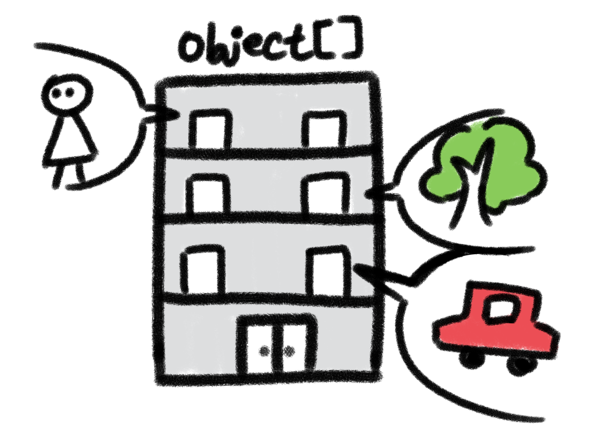

> 어느날 김영한님의 중급1편의 섹션2를 듣고 잠시 잠이 들었다. 그리고 눈을 떠보니 A대학교 학생으로 된 상태이다.
> 그리고 A대학교의 아끼는 후배가 마침 Object 클래스에 대해 쉽게 알려달라고 한다.
> 후배는 비전공자이고 아무것도 모르는 상태이다. 최대한 쉽게 설명해보자.

---

### 1. 오브젝트의 기본 이해

    <figure>
        
        <figcaption>오브젝트 안에 고래가 입주한 상태</figcaption>
    </figure>

 

오브젝트는 무엇이든 들어갈 수 있는 **마법의 집**이라고 볼 수 있다. **크기도 종류도 관계 없이 단 하나**가 들어가는 집이다.

무엇이 들어가든 집이라는 공간은 변하지 않기 때문에, 전기나 수도 같은 집 안에 원래 있는 옵션(= 묵시적 상속 / 내장 메서드)은 사용할 수 있다.

### 2. 오브젝트 배열

 

    <figure>
        
        <figcaption>오브젝트로 이루어진 아파트</figcaption>
    </figure>

 

여러 종류의 오브젝트를 넣는 방법도 존재한다. 배열이라는 이름의 아파트로 생각해보자. 아파트의 각 세대 하나하나가 오브젝트라 불리는 마법의 집이 되는 것이다.

### 3. 오브젝트의 메서드

오브젝트는 동일한 옵션(= 내장 메서드)을 갖고 있다. 우리가 집에서 전기나 수도를 당연하게 사용하고 벽지와 바닥이 당연하게 존재하는 것처럼, 오브젝트 안에도 이런 당연한 기능들이 존재한다. 이 각 기능은 개발자가 **적절하게 리모델링**(= 오버라이딩)할 수도 있다.

 

    <figure>
        
        
        <figcaption>오브젝트의 메서드 호출 시 결과</figcaption>
    </figure>

 

대표적인 오브젝트의 내장 옵션은 아래와 같다.
1. 안에 무엇이 들어있는지? 내 주소(참조값)가 무엇인지? (= **.toString()**)
2. 다른 객체와 동일한지? (= **.equal()**)
